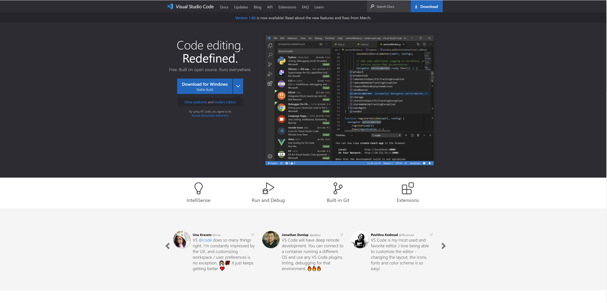
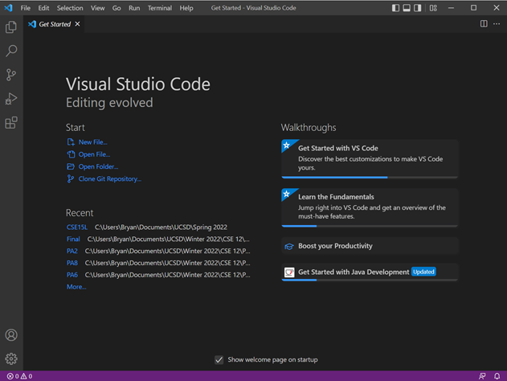
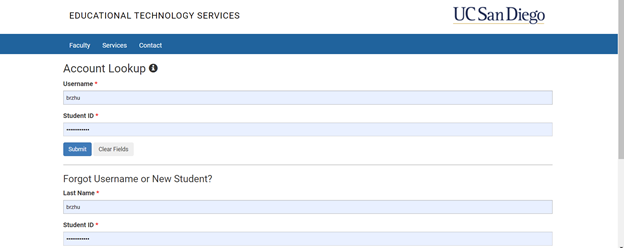
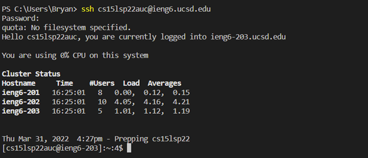
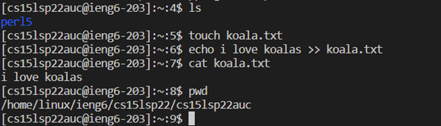
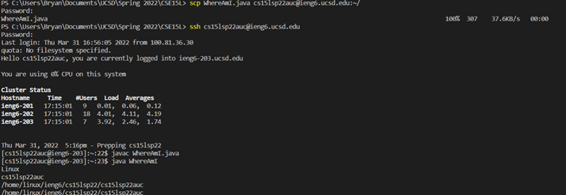
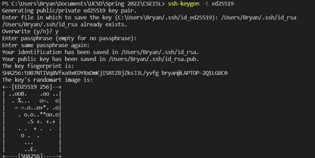
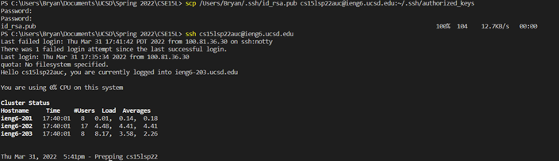
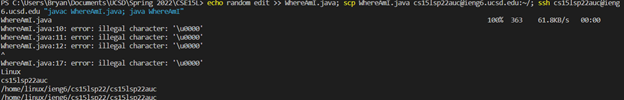

# Week 2 Lab Report

## Installing VSCode
* Our first task is installing Visual Studio Code (click [here](https://code.visualstudio.com/))
and download the appropriate installer for your OS.  Run and follow the installer instructors.

* Upon completion, try opening up VSCode.  This will bring you to a new home page, which should look something like this:


## Remotely Connecting
* To remotely connect to the computers at _ieng6_, we will use Secure Socket Shell (SSH) protocol.
* For Windows systems (like mine), first install [OpenSSH](https://docs.microsoft.com/en-us/windows-server/administration/openssh/openssh_install_firstuse).  Like VSCode, simply follow the installer’s instructions.  I had already done this prior to the lab, so no screenshots are shown here.
* To find the address at which to remotely connect, you can locate your CSE15L account via the [Account Lookup Tool](https://sdacs.ucsd.edu/~icc/index.php).

* To begin the remote connection process, start a new instance of the terminal in VSCode via Ctrl + Shift + `.
* Type `ssh cs15lsp22***@ieng6.ucsd.edu` where *** is given by your own account.  My account is given by _auc_, as shown in the screenshot below.  It will prompt you for your account password.  Once connected, you should see something below like this.


_*Note: If this is your first connection to this server, you will get a confirmation you trust the server before you can connect.  Just confirm “yes” and you will connect successfully._

## Trying Some Commands

* There are a variety of commands you can run on the terminal.  Some that I personally ran during the lab are shown below.

* Some notes regarding the commands shown are as follows:
    * `ls` lists files and directories under current directory.  Arguments can be appended to it (e.g -a used to show all files including hidden ones).
    * `touch` creates a new file; in the above example, it creates a file named koala.txt
    * `echo`, as used above with `>>`, will take the text before `>>` and append it to a specified file (koala.txt)
    * `cat` displays contents of a specified file
    * `pwd` prints working directory

* Once you've had enough fun running linux commands, type `exit` in terminal to close it.

## Moving Files Over SSH With SCP

* We will now use SCP (Secure-Copy Protocol) to transfer files from the client to the server.
* During the lab, we were provided a copy of a java program _WhereAmI.java_, whose contents are as seen below:
```
class WhereAmI {
    public static void main(String[] args) {
        System.out.println(System.getProperty("os.name"));
        System.out.println(System.getProperty("user.name"));
        System.out.println(System.getProperty("user.home"));
        System.out.println(System.getProperty("user.dir"));
    }
}
```
* To copy this file over to the server, type the command `scp WhereAmI.java cs15lsp22auc@ieng6.ucsd.edu:~/` (again, replacing _auc_ with a specific course account) and typing your account password.



* As a clarification to how the `scp` command works, the first argument is what file you want moved.  The second argument is the server address followed by `:~/` to copy it to the home directory.  Note the directory can be changed to copy to an alternate location.

## Setting Up an SSH Key

* We can set up an SSH Key to generate a set of private and public keys to make it easier to log in to the remote server without the need to type in our password every time.  Start by running the command `ssh-keygen -t ed25519` on the client side.  When prompted for a passphrase, simply click enter.


* Now that you have created both a private and a public key, make a directory _.ssh_ on your remote server and use the `scp` command we used earlier to copy the private key from your client computer to the authorized_keys directory on the server.



* Now that you've copied the public key _id_rsa.pub_ onto the server side, when using ssh to log in you should
no longer need to use a password to log-in!


## Optimizing Remote Running

* In order to further optimize our terminal-based adventures, we can utilize the fact that multiple commands can be run on the same line when seperated by `;`.  Furthermore, wrapping commands in quotation marks will run the enclosed command on the server (given that it is being ran alongside `ssh`). 
* With this in mind, if one wanted an optimized command to append to a file and run it on the remote server, a potential solution is the command `echo (edit) >> WhereAmI.java; scp WhereAmI.java cse15lsp22auc@ieng6.ucsd.edu; ssh cs15lsp22auc@ieng6.ucsd.edu “javac WhereAmI.java; java WhereAmI”`



* The command works because after editing the file (which can be done with other commands as well; `echo` is just one option), the file is copied onto the remote server, then the client connects to the remote server and runs `javac` and `java` at once.


[Return To Home](https://zhuzilibryan.github.io/cse15l-lab-reports/)