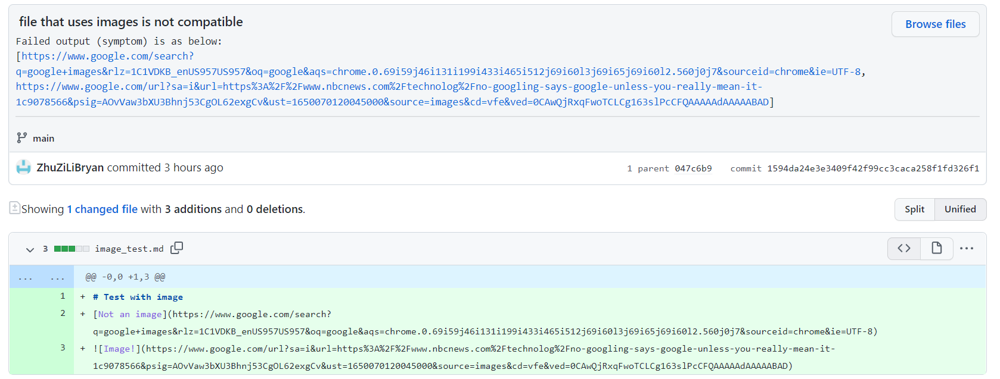
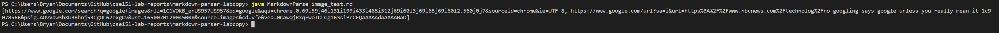
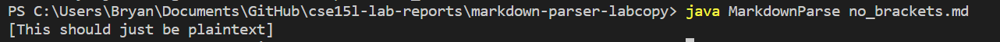

# Week 4 Lab Report

## Introduction

In Week 3, we worked with Github in committing and pushing various small changes
to practice **incremental development**.  In total, three different 
failure-inducing input markdown files were used to detect shortcomings of the
original file we were provided with.  After analyzing the symptoms and 
determining the bug, we reworked our code to work with the new files while ensuring compatibility with
other markdown files.  Below is a record of three bugs that were fixed.
-----

## First Bug
### Failure-Inducing Input
The failure-inducing input is as shown below:

[Link to Bugged Commit](https://github.com/ZhuZiLiBryan/markdown-parser/commit/08550bb5e026eacbd5d8d123d5cfef97021cdf31)
### Symptom of Failure-Inducing Output
The symptom was an exception thrown, as seen by console output below:

### Relation of Bug, Symptom, and Failure-Inducing Input

---

## Second Bug
### Failure-Inducing Input
The failure-inducing input is as shown below:

[Link to Bugged Commit](https://github.com/ZhuZiLiBryan/markdown-parser/commit/1594da24e3e3409f42f99cc3caca258f1fd326f1)

This failure-inducing input was special because it contained links to images.
### Symptom of Failure-Inducing Output
The symptom was that both links, regardless of whether it was an image or not, 
would be returned in the final list, as seen by console output below:

### Relation of Bug, Symptom, and Failure-Inducing Input

---

## Third Bug
### Failure-Inducing Input
The failure-inducing input is as shown below:

[Link to Bugged Commit](https://github.com/ZhuZiLiBryan/markdown-parser/commit/50071ba70038d373c043e413d2fcfe8d2924ca13)

This failure-inducing input was special because it contained parentheses
but they were not links, thus there would be no brackets.
### Symptom of Failure-Inducing Output
The symptom was that the first line of the file, despite not being a link,
would end up being returned in the final list, as seen by the console
output below:

### Relationship of Bug, Symptom, and Failure-Inducing Input

---

[Return To Home](https://zhuzilibryan.github.io/cse15l-lab-reports/)