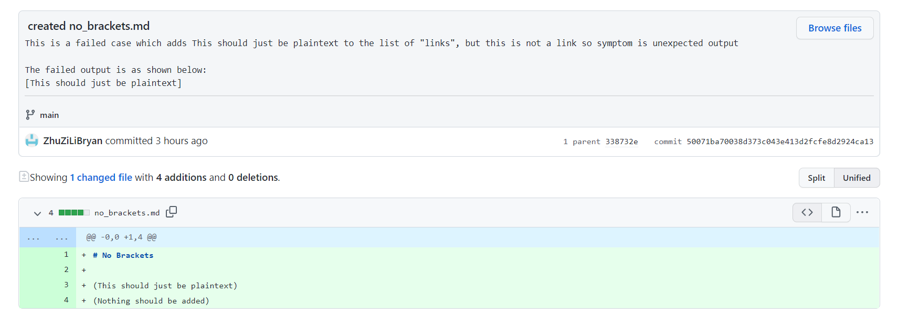

# Week 4 Lab Report

## Introduction

In Week 3, we worked with Github in committing and pushing various small changes
to practice **incremental development**.  In total, three different 
failure-inducing input markdown files were used to detect shortcomings of the
original file we were provided with.  After analyzing the symptoms and 
determining the bug, we reworked our code to work with the new files while ensuring compatibility with
other markdown files.  Below is a record of three bugs that were fixed.
-----

## First Bug
### Failure-Inducing Input
The failure-inducing input is as shown below:

[Link to Failure-Inducing Input](https://github.com/ZhuZiLiBryan/markdown-parser/commit/08550bb5e026eacbd5d8d123d5cfef97021cdf31) |
[Link to Code with Bug](https://github.com/ZhuZiLiBryan/markdown-parser/commit/7a7ad0cf2ddb295469a2081fe6e45f64b1da6554) (Original Code)
### Symptom of Failure-Inducing Output
The symptom was an exception thrown, as seen by console output below:

### Relation of Bug, Symptom, and Failure-Inducing Input
With the orignal code provided, the issue was that it failed to account for potential
closing parentheses within the link itself (the failure-inducing output).  The bug 
in the code is that it only considered the first instance of a `)`, as is the nature of
the `indexOf()` method.  Thus, since the program will take the substring from the index of
an opening to the first closing parentheses, a `)` within the link would cut the link short.
As a result, the value of `currentIndex`, which is assigned to be the index of the closing 
parentheses plus one, would have the wrong index (and be a part of the first link), thus forcing
the program into an infinite loop and causing a heap space error.

---

## Second Bug
### Failure-Inducing Input
The failure-inducing input is as shown below:

[Link to Failure-Inducing Input](https://github.com/ZhuZiLiBryan/markdown-parser/commit/1594da24e3e3409f42f99cc3caca258f1fd326f1) |
[Link to Code with Bug](https://github.com/ZhuZiLiBryan/markdown-parser/commit/047c6b97af275972beade36930f0c386645d6fe5)

This failure-inducing input was special because it contained links to images.
### Symptom of Failure-Inducing Output
The symptom was that both links, regardless of whether it was an image or not, 
would be returned in the final list, as seen by console output below:

### Relation of Bug, Symptom, and Failure-Inducing Input
The bug in the code was that, although all links could now be succesfully extracted from the `.md` file, there
was no conditional in the program that considered the possiblity of a link that we *didn't* want to extract
(i.e: links to images).  The resulting symptom was getting a list of all links, image links included.  Thus, any file with a link to an image using the format `` would be failure-inducing output.

---

## Third Bug
### Failure-Inducing Input
The failure-inducing input is as shown below:

[Link to Failure-Inducing Input](https://github.com/ZhuZiLiBryan/markdown-parser/commit/50071ba70038d373c043e413d2fcfe8d2924ca13) |
[Link to Code with Bug](https://github.com/ZhuZiLiBryan/markdown-parser/commit/338732e03c23ef3560c887f153ea4cb7028f5f00)

This failure-inducing input was special because it contained parentheses
but they were not links, thus there would be no brackets.
### Symptom of Failure-Inducing Output
The symptom was that the first line of the file, despite not being a link,
would end up being returned in the final list, as seen by the console
output below:

### Relationship of Bug, Symptom, and Failure-Inducing Input
The bug of the code was that as long as the indices of opening and closing parentheses could be found,
the contents within would be extracted to the list.  This failed to account for the possibility of plaintext
in parentheses (much like the text here!).  In particular, the bug was that it didn't account for a lack of brackets alongside parentheses.  This would cause a symptom that anything within parentheses, regardless if its a link or not, would be extracted.  Thus, the failure-inducing input would be any `.md` file that had non-link parentheses.

---

[Return To Home](https://zhuzilibryan.github.io/cse15l-lab-reports/)