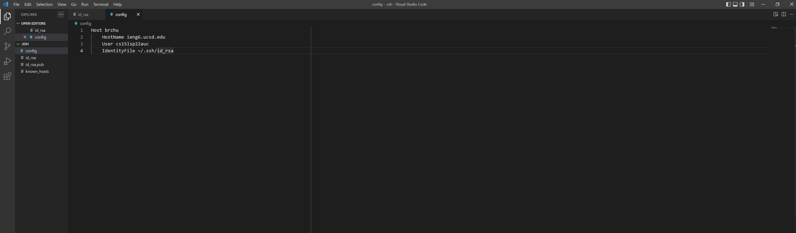
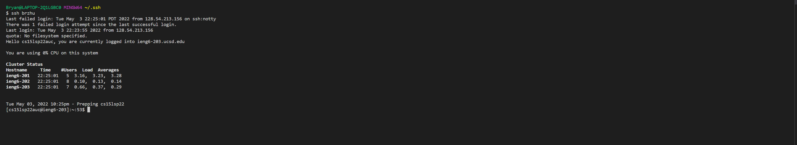
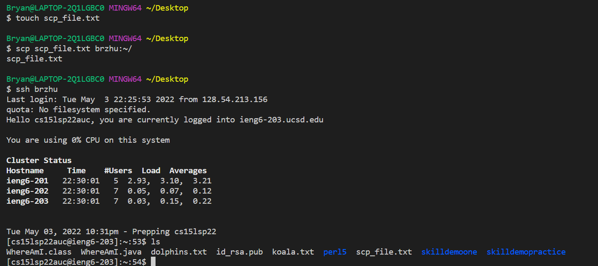
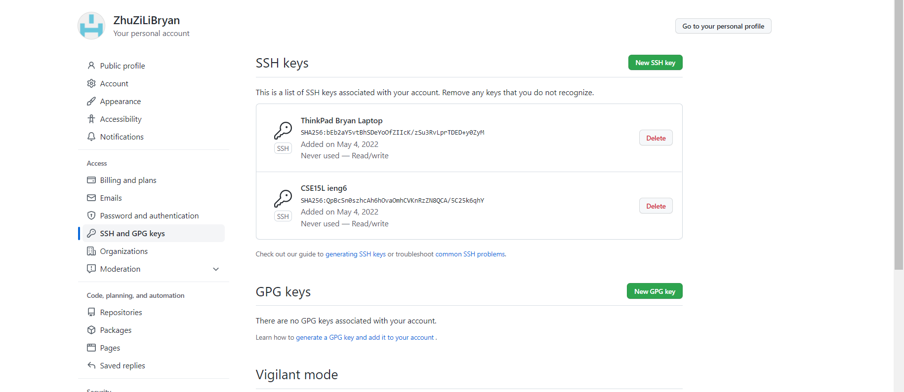
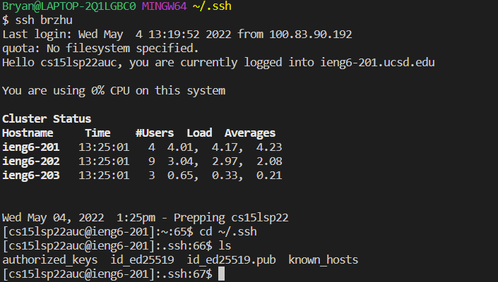
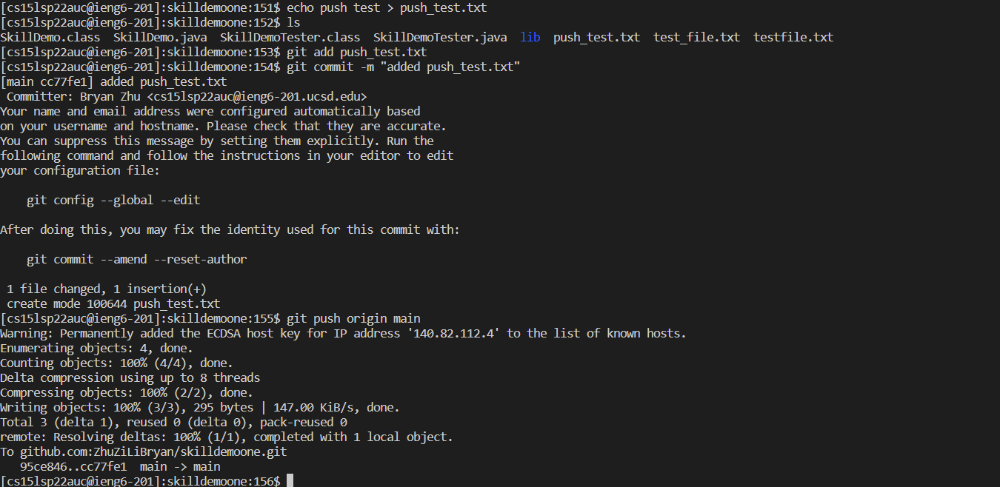
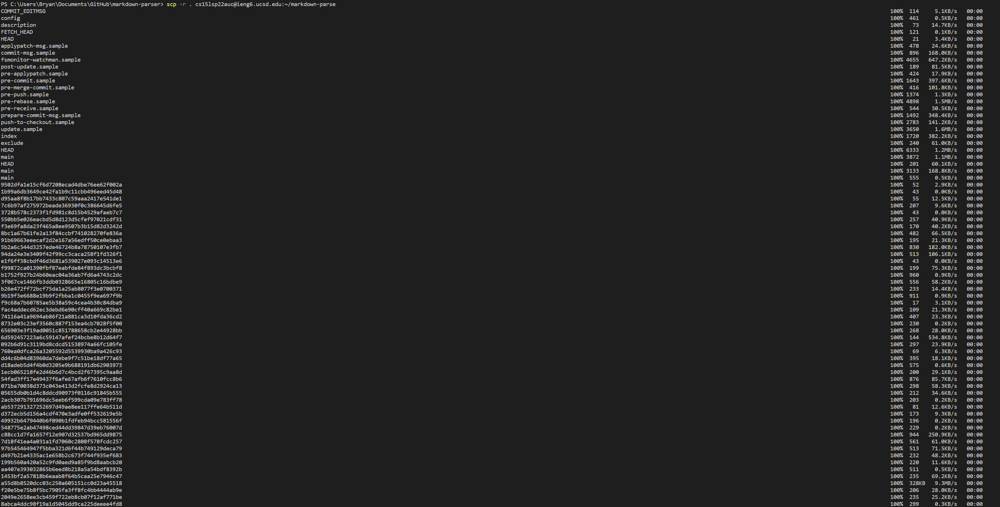
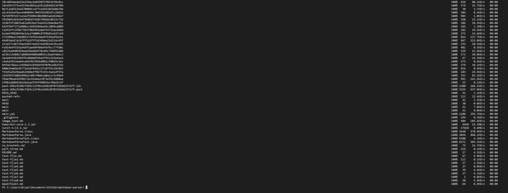
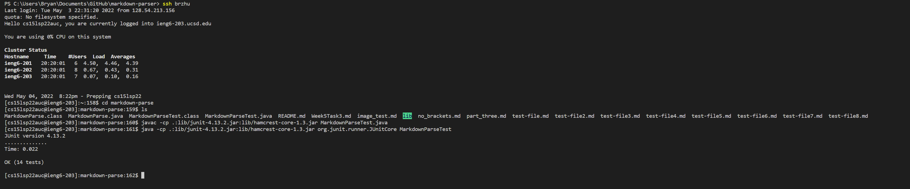
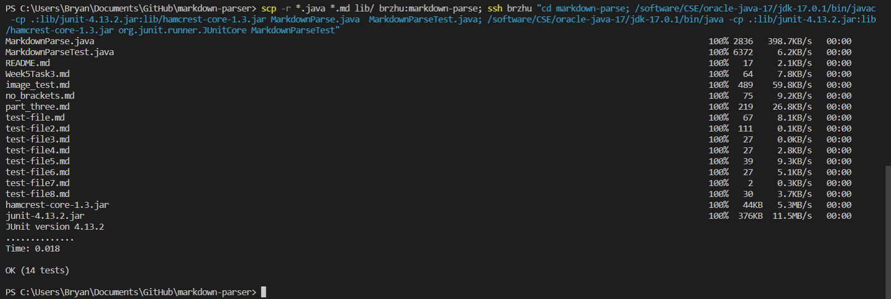

# Week 6 Lab Report

## Streamlining ssh configuration
The first trick I learned was to adjust the configuration of the remote login, such
that I could login without typing a long remote address.



First, I used VSCode to access the config file in my `.ssh` folder.  I configured it
by adding the lines below:
```
Host brzhu
    HostName ieng6.ucsd.edu
    User cs15lsp22auc 
    IdentityFile ~/.ssh/id_rsa
```
Note that the name to the right of `Host` can be customized; this will be used to login through
the terminal.

After configuring the config file, I could simply use `ssh brzhu` to login to the remote server.


As you can see, it is no longer necessary to type an entire remote address.  To test the functionality,
I created a new file `scp_file.txt` and copied it over using the new username.


It is seen that the new file can indeed be found on the remote server, indicating that the new functionality
works.

## Setup Github Access from ieng6

The second trick I learned was to setup access to GitHub through my remote computer on ieng6.

To accomplish this, I used the `ssh-keygen` command to create a private key and public key.  The public key can be found both on GitHub and on my user account.

The public key is accessible through the SSH and GPG keys tab in my GitHub settings.  Shown above are keys for my local computer and my ieng6 remote computer.

As shown above, a local copy of the SSH key is also in my `.ssh` directory.  It is the file denoted `id_ed25519.pub`.  Also note that the private key can be found in this same directory, which is `id_ed25519`.  This is not copied anywhere else, and is only accessible on my local account.

After generating these keys and adding them to GitHub, I was able to run `git push origin main` on my ieng6 computer.  Below, I created a file called `push_test.txt`, which I added to the staging area, committed it, and used `git push origin main`.  It was succesfully pushed to the main branch.



A link to the commit itself is found here: [Link to Commit](https://github.com/ZhuZiLiBryan/skilldemoone/commit/cc77fe183d3085d09809e12fe79babb294e56d2e)

## Copy Whole Directories with `scp -r`

The third trick I learned was to use a new argument, `-r`, to copy entire directories across computers via the `scp` command. 
In the image below, I used `scp -r . cs15lsp22@ieng6.ucsd.edu:~/markdown-parse` to recursively copy all files into my ieng6 remote computer.



As one can see above, every element in the directory was copied over (including hidden files).  To prove this, I logged in and ran the test file on the remote server.



All of the above can be expedited by multiple commands stringed together via `;` and specifying which commands to run on the server.  I composed a command like below:
```
scp -r *.java *.md lib/ brzhu:markdown-parse; ssh brzhu "cd markdown-parse; /software/CSE/oracle-java-17/jdk-17.0.1/bin/javac -cp .:lib/junit-4.13.2.jar:lib/hamcrest-core-1.3.jar MarkdownParse.java  MarkdownParseTest.java; /software/CSE/oracle-java-17/jdk-17.0.1/bin/java -cp .:lib/junit-4.13.2.jar:lib/hamcrest-core-1.3.jar org.junit.runner.JUnitCore MarkdownParseTest"
```


As you can see, upon running this command, all the necessary files were copied over, the tests were compiled, and run without the need to type multiple commands sequentially.

---

[Return To Home](https://zhuzilibryan.github.io/cse15l-lab-reports/)