# Week 8 Lab Report

[Link to My Repository](https://github.com/ZhuZiLiBryan/markdown-parser)

[Link to Other Group's Repository](https://github.com/Aaron3963/MarkdownParser)

To test each snippet for both my repo and the other groups repo, I wrote and
appended the following tests for each snippet for each repo, resulting in six
tests in total:
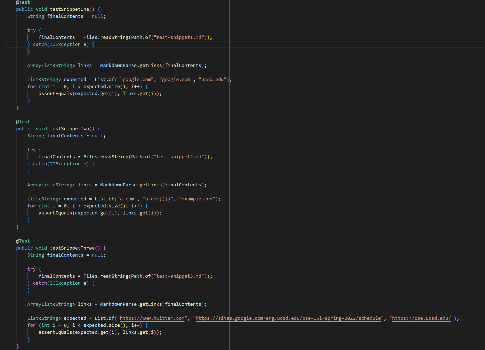

## Testing Snippet 1

### Expected Outcome:

Based on the preview in VSCode, the expected outcome is as follows:

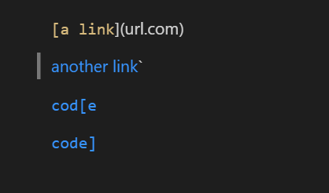

Thus a list of links should include:  _`google.com, google.com, ucsd.edu_

### Code Used to Test:

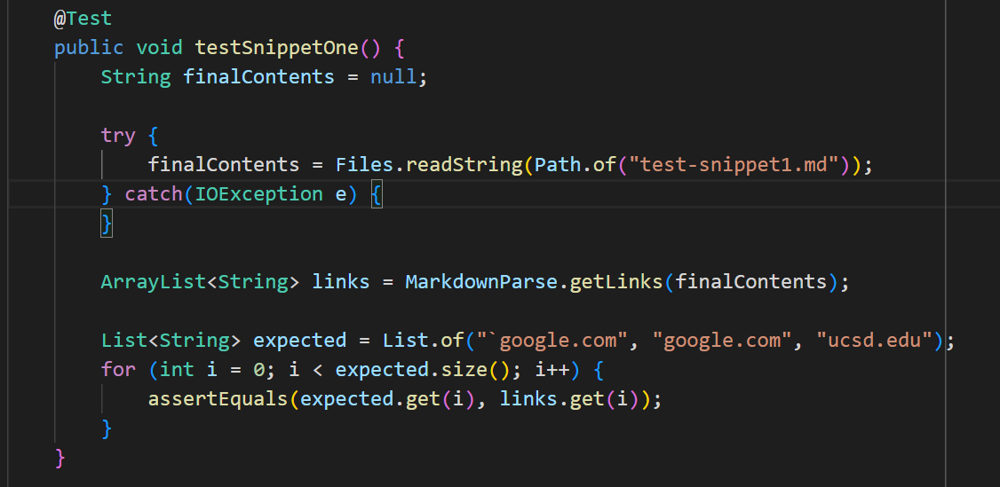

### JUnit Outputs:

My code resulted in a failure:
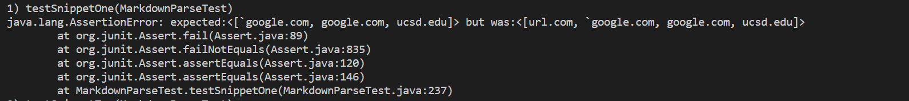

The other repo also resulted in a failure:
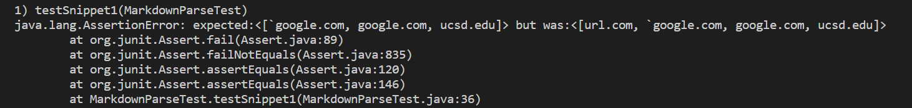

### How to Improve My Code:

My hypothesis was that there was a small code change I could amend to my program
to fix the bug.  The bug was that I lacked a conditional to check if an opening
bracket lies in between two backticks.  To amend this, I would want to add
a conditional that checks if the first instance of an opening bracket lies in between two backticks; if this
is the case, I should skip over the fake link and continue parsing the file starting from the end of that fake link.

I proceeded to add this functionality to my code, and resolve the issue.  All that was done was create more variables
to keep track of backticks and check to see if brackets lied in between them:
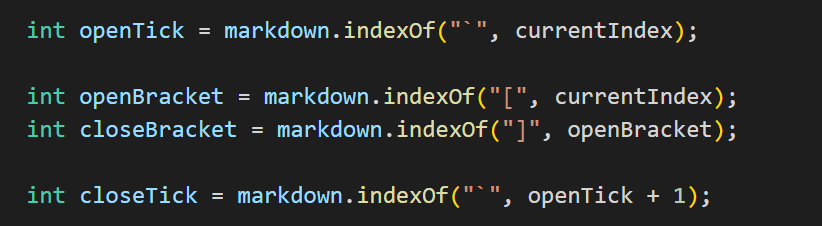
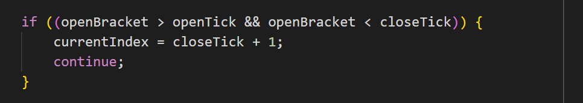

## Test Snippet 2

### Expected Outcome:

Based on the preview in VSCode, the expected outcome is as follows:

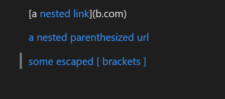

Thus a list of links should include: _a.com, a.com(()), example.com_

### Code Used to Test:

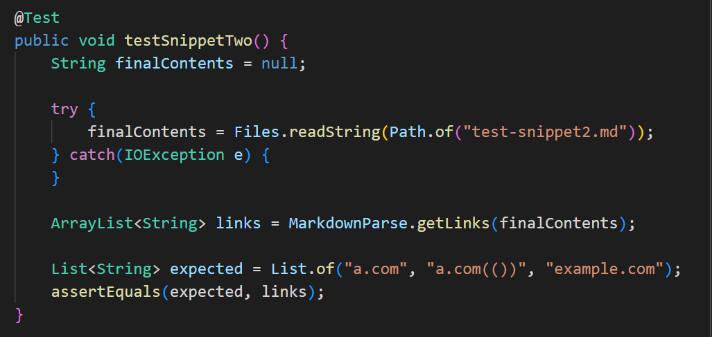

### JUnit Outputs:

My code resulted in a failure:
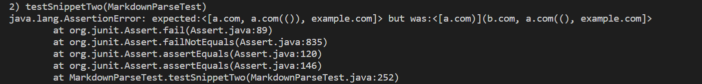

The other repo also resulted in a failure:
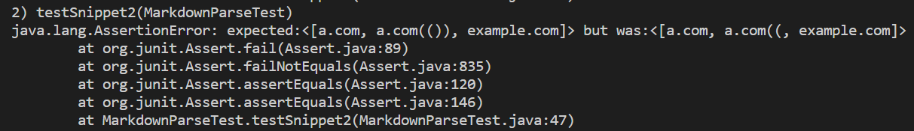

### How to Improve My Code:

My hypothesis was that a larger code change was necessary to fix the bug in the program.  This is because my
implementation actually specifically searches for the last parentheses of a link, but this raises a problem when there are nested links with more parentheses and brackets.  This would cause issues such as nested links being carried on too long or links with multiple parentheses being cut short.  

To amend the issue of multiple parentheses being cut short (like _a.com(())_ being turned into _a.com(()_, I made a check to see if the link that the program detected had any extra closing parentheses inside and, if so, only treat the outermost parentheses as the real closign parentheses.  The amendment is shown below:
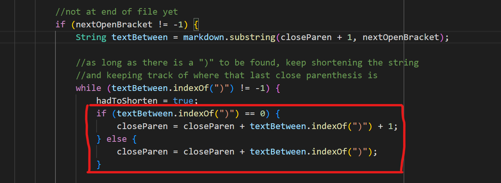

To amend the issue of a nested link being too long because of my implementation seeing the NEXT link as the final parentheses, I made a conditional to check the link for any nested brackets.  If these existed, I would try to extract the innermost parentheses, since that nested link is the real link.  The amendment is shown below:
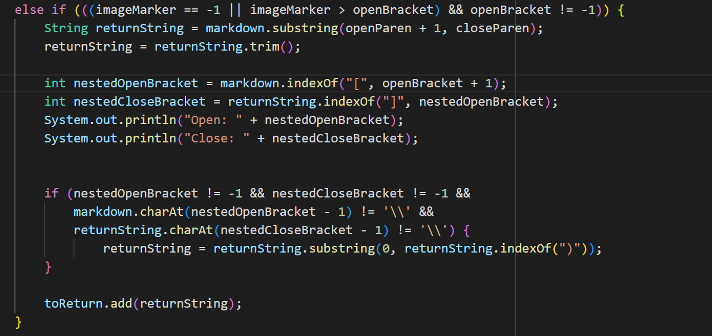

## Testing Snippet 3

### Expected Outcome:

Based on the preview in VSCode, the expected outcome is as follows:

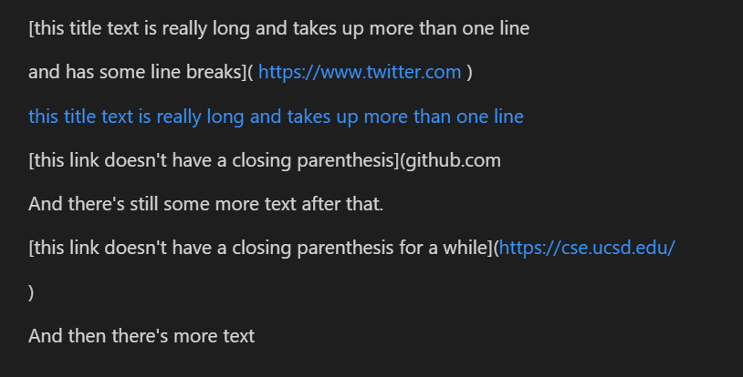

Thus a list of links should include:  _https://www.twitter.com, https://sites.google.com/eng.ucsd.edu/cse-15l-spring-2022/schedule, https://cse.ucsd.edu/_

### Code Used to Test:

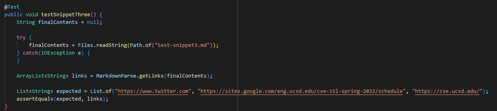

### JUnit Outputs:

My code resulted in a failure:
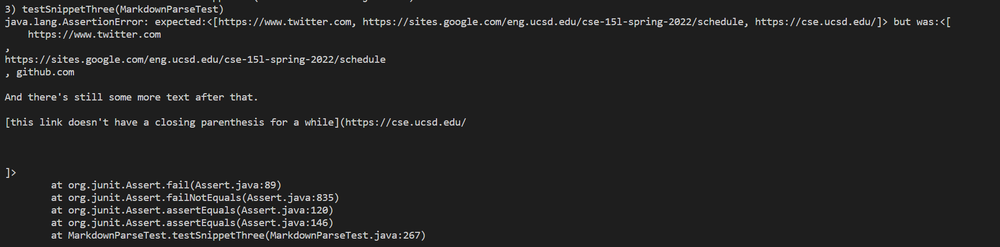

The other repo also resulted in a failure:
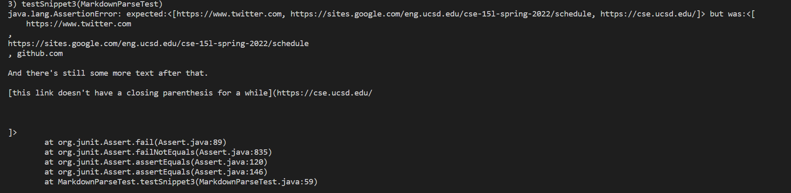

### How to Improve My Code:

FINISH LATER

[Return To Home](https://zhuzilibryan.github.io/cse15l-lab-reports/)