# Week 10 Lab Report

## Introduction
For this lab, I used the vimdiff software to find places where my output diffrentiated from the output
of the given implementation for markdown parse.  To do this, I used the linux command `bash script.sh > results.txt`, which ran all the provided test files and saved their information to a text document.  I used the provided script
on both implementations. To demonstrate the differences and provide potential solutions
to the bugs, I have taken 2 different test cases and elaborated on them below.

## Test One

Using Vimdiff, I could easily scroll down all the different outputs between my implementation and the given implementation, and one of those differences were seen for the file `201.md`.  As seen below, the output for my implementation is given on the left while the output for the provided implementation is on the right.  My output shows
no links extracted, while the given implementation provided the link _"baz"_.  A link to the test file can be [found here](https://github.com/ZhuZiLiBryan/markdown-parser/blob/main/test-201.md).
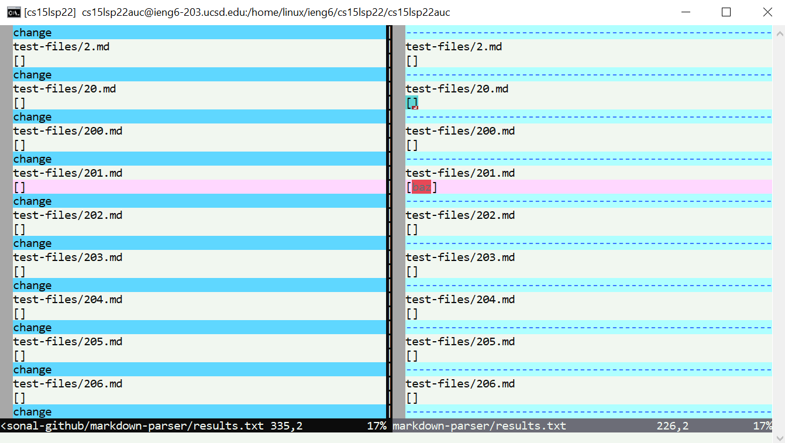

To determine which output between the two is correct, I observed the markdown preview on VSCode.  According to the preview, there are no valid links.  The expected output should be `[]`, a list with zero links.

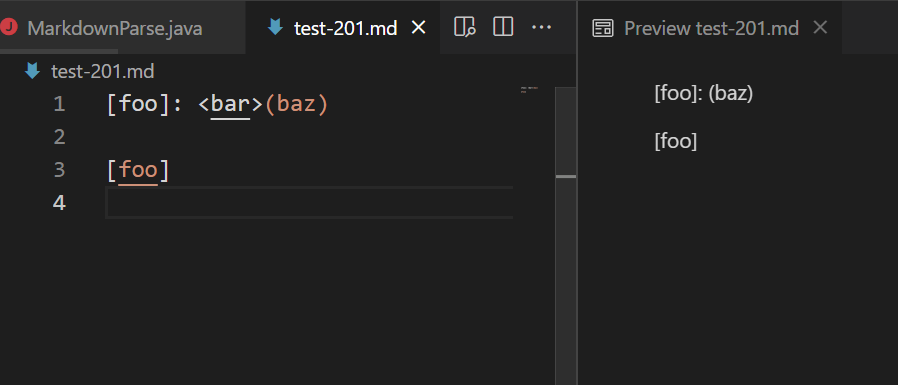

My implementation has no links extracted:
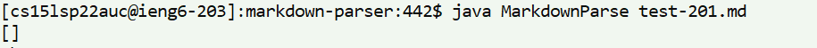

The given implementation has _"baz"_ extracted:
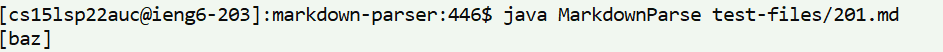

This implies that my implementation is correct, while the given implementation fails.

The bug of the given implementation is that it fails to account for occurances where the parentheses is seperated from the brackets, which would de-validify the link.  The test file `201.md` as pictured above, for example, had `(baz)` seperated from `[foo]` with `<bar>` in between.  Thus `baz` should not be considered a valid link.  The bug is that there is a lack of consideration of extra characters between `nextCloseBracket` and `openParen`.  The given implementation has the following code.

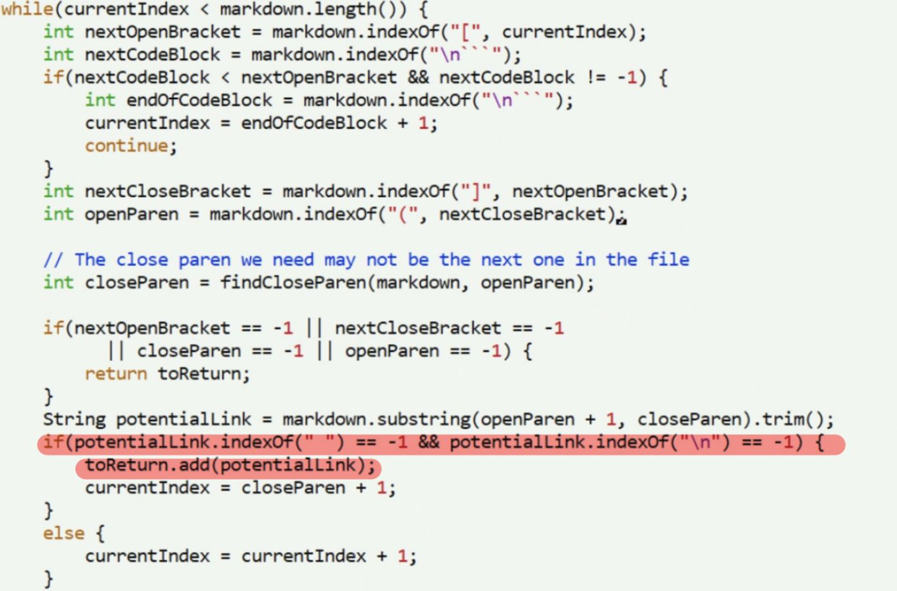

As I have shown above, there is a conditional to check whether or not there is whitespace within the extracted link.  The conditional lacks a check to see if there is anything between the parentheses and the bracket however.  My solution would be to append an extra check within parentheses highlighted in red, where I would check to see if the character at the index before the opening parenthesis is the same closing bracket as `nextCloseBracket`.  As long as the parentheses indices directly follow `nextCloseBracket` (thus no whitespace or extra characters in between them), then it is a valid link.

### Test Two

Using Vimdiff, I could easily scroll down all the different outputs between my implementation and the given implementation, and one of those differences were seen for the file `489.md`.  As seen below, the output for my implementation is given on the left while the output for the provided implementation is on the right.  My output shows the output:
```
[foo
bar]
```
while the given implementation provided the zero links.  A link to the test file can be [found here](https://github.com/ZhuZiLiBryan/markdown-parser/blob/main/test-489.md).

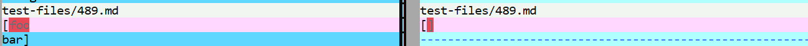

To determine which output between the two is correct, I observed the markdown preview on VSCode.  According to the preview, there are no valid links.  The expected output should be `[]`, a list with zero links.

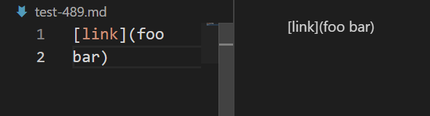

My implementation has one "link" extracted:
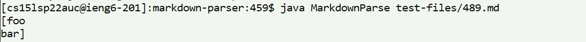

The given implementation has nothing extracted:
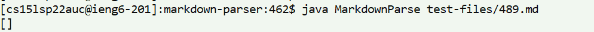

This implies that the given implemenation is correct, while my implementation fails.

The bug of my implementation is that nowhere in the program do I consider the occurance of whitespace within the link.  That is, if the link is split onto multiple lines via newline characters or there are spaces in between the link, the link is invalid.  Test file `489.md` as shown above, for example, has foo and bar written on different lines, thus invalidating it as a link.  My implementation is shown in the following code below in 2 relevant snippets:

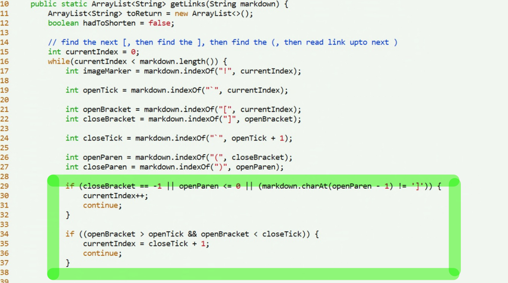
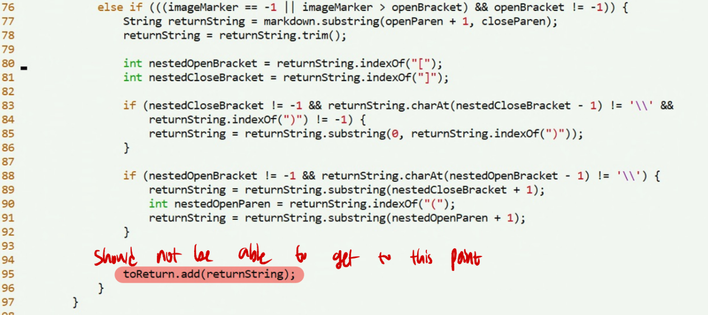

Above, the bug is found highlighted in the red section, in that there is a lack of checking for whitespace within the link.  Note that at line 78 the `.trim()` method is used to get rid of whitespace before and after the link, but there is no consideration for whitespace within the link.  Thus, an input like:
```
foo
bar
```
would have been considered valid.  To remedy this, I would append another conditional check as I did for other situations, at the lines boxed in green.  I would add a check to see that if there was whitespace in between words by using the `indexOf()` method and seeing if there are spaces, then if there are, invalidate the current link and move on to the next part of the markdown file by increasing `currentIndex`.